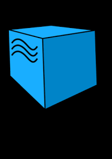
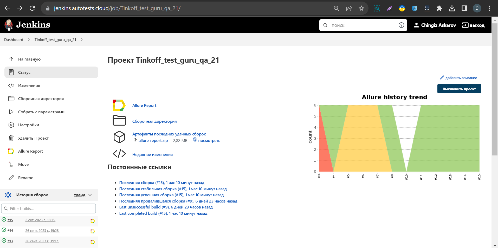
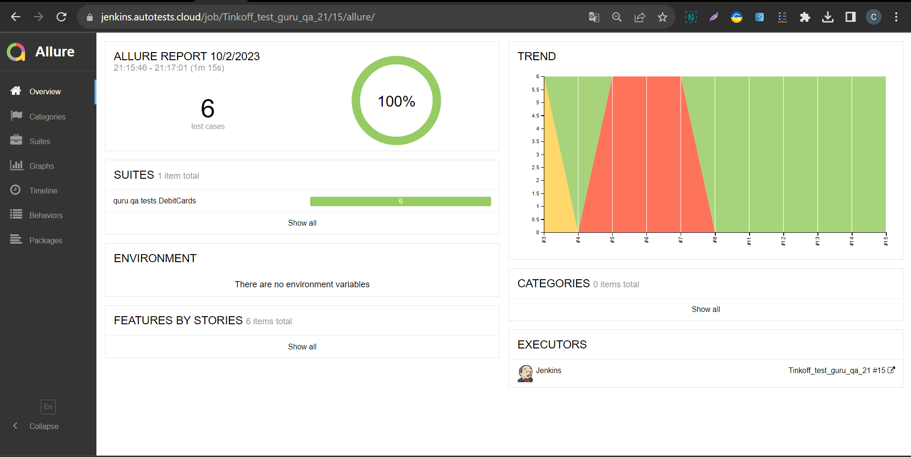
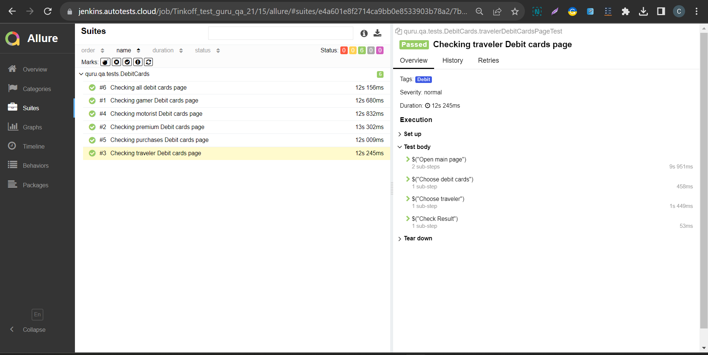
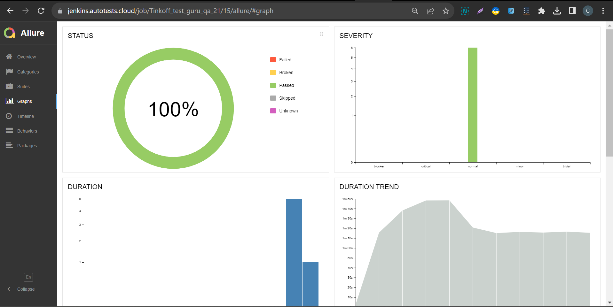
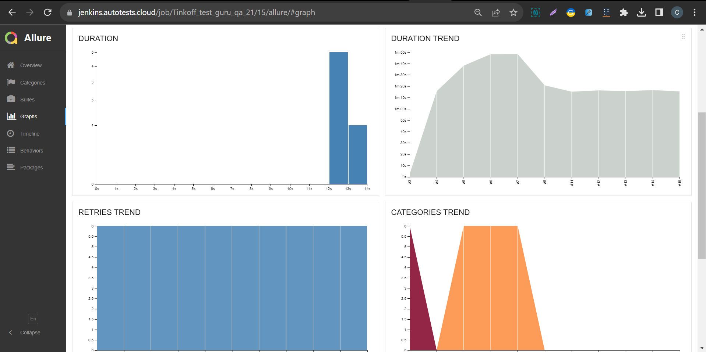
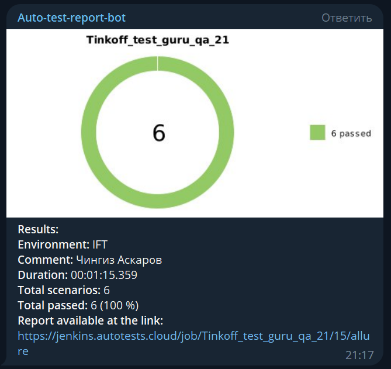
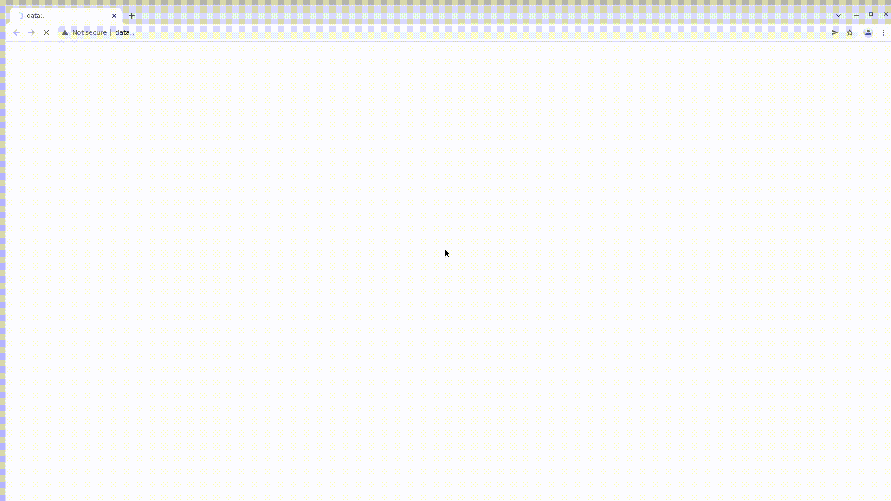

<h1 >Проект по автоматизации тестирования сайта <a href="https://www.tinkoff.ru/ "> Tinkoff</a></h1>

<p align="center">  
</a>  
</p>

# 🧾 Содержание:

- Технологии и инструменты
- Список проверок, реализованных в автоматизированных тест-кейсах
- Запуск тестов (Сборка в Jenkins)
- Запуск тестов (Из терминала)
- Allure-отчет
- Интеграция с Allure TestOps
- Интеграция с Jira
- Уведомление в Telegram о результатах выполнения автоматизированных тестов
- Видеопример прохождения тестов Selenoid

<a id="tools"></a>
## 🔨 Технологии и инструменты:

| Java                                                                                 | IntelliJ  <br>  Idea                                                                                               | GitHub                                                                                                     | JUnit 5                                                                                                           | Gradle                                                                                                     | Selenide                                                                                                         | Selenoid                                                                                                                  | Allure <br> Report                                                                                                         |  Jenkins                                                                                                        |   Jira                                                                                                              | Telegram                                                                                                            |Allure <br> TestOps                                                                                                          
|:-------------------------------------------------------------------------------------|--------------------------------------------------------------------------------------------------------------------|------------------------------------------------------------------------------------------------------------|-------------------------------------------------------------------------------------------------------------------|------------------------------------------------------------------------------------------------------------|------------------------------------------------------------------------------------------------------------------|---------------------------------------------------------------------------------------------------------------------------|----------------------------------------------------------------------------------------------------------------------------|-----------------------------------------------------------------------------------------------------------------|---------------------------------------------------------------------------------------------------------------------|---------------------------------------------------------------------------------------------------------------------|----------------------------------------------------------------------------------------------------------------------------------:|
| <a href="https://www.java.com/"></a>  | <a href="https://www.jetbrains.com/idea/"></a> | <a href="https://github.com/"></a> | <a href="https://junit.org/junit5/"></a> | <a href="https://gradle.org/"></a> | <a href="https://selenide.org/"></a> | <a href="https://aerokube.com/selenoid/"></a> | <a href="https://github.com/allure-framework"></a> |<a href="https://www.jenkins.io/"></a> | <a href="https://www.atlassian.com/software/jira/"></a> | <a href="https://web.telegram.org/"></a> |<a href="https://qameta.io/"></a> |


##  Сборка в [Jenkins](https://jenkins.autotests.cloud/job/Tinkoff_test_guru_qa_21/)

<p align="center">  
</a>  
</p>

<a id="cases"></a>
## 🏁 Реализованные проверки:

- Переход в раздел "Дебетовые карты"
- Переход в раздел "Премиальные дебетовые карты"
- Переход в раздел "Дебетовые карты для путешествий"
- Переход в раздел "Дебетовые карты для автомобилистов"
- Переход в раздел "Дебетовые катры для геймеров"
- Переход в раздел "Дебетовые карты для покупок"


## 📋 Параметры сборки в Jenkins:

- 
- _SELENOID_BASE_URL (URL Selenoid, по умолчанию selenoid.autotests.cloud)_
- _ENVIRONMENT (Стенд проверка, по умолчанию IFT)_
- _BROWSER (Браузер, по умолчанию chrome)_
- _BROWSER_VERSION (Версия браузера, по умолчанию 100.0)_
- _BROWSER_SIZE (Размер окна браузера, по умолчанию 1920x1080)_
- _COMMENT (Имя инженера запустившего сборку, по умолчанию пусто)_

## 🚀 Команда для запуска автотестов из терминала

Удаленный запуск с использованием Jenkins и Selenoid (требуется логин и пароль):
```bash  
gradle clean test -Denv=debit
```

##  </a>Интеграция с <a target="_blank" href="https://jenkins.autotests.cloud/job/Tinkoff_test_guru_qa_21/15/allure/">Allure Report</a>


## 🖨️ Основная страница отчёта

<p align="center">  
  
</p>  

## 📄 Тестовый прогон

<p align="center">  
   
</p>

## 📊 Графики

<p align="center">   
  
  
 
</p>

____
## </a> Уведомление в Telegram при помощи бота
____
<p align="center">  
  
</p>

----
## </a> Видеопример выполнения теста на Selenoid
____
<p align="center">
   
</p>